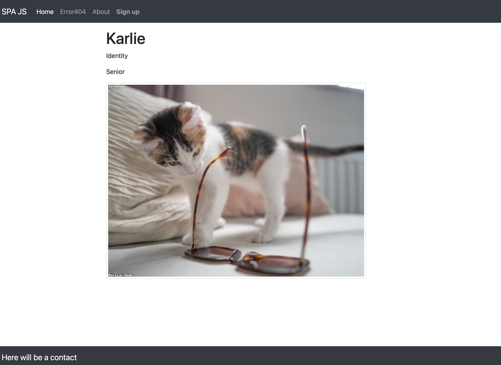

### Single Page Application on JS ES6 with router and MVC

[](https://meugenom.github.io/spa-mvc-router/)
</br>


</br>


[DEMO](https://meugenom.github.io/spa-mvc-router/)

This is a Single Page Application written in JavaScript ES6, using a simple router and the MVC pattern, and styled with Bootstrap CSS.

### Each component has three files

- index.js which acts as the `Controller`
- model.js which contains the `Model`
- view.js which holds the `View`

For example, the component `Home` has these files located in the `/src/components/home/` folder.

### How to run 

1. Clone the repository with the command `git clone https://github.com/meugenom/spa-mvc-router.git`
2. Change to the directory with `cd spa-mvc-router`.
3. Build the pages with `yarn`.
4. To use the application in dev mode, run `yarn start` in the terminal.

### How to build
```bash
    yarn build && cd dist
```

AUTOR: [https://meugenom.com](https://meugenom.com). 

