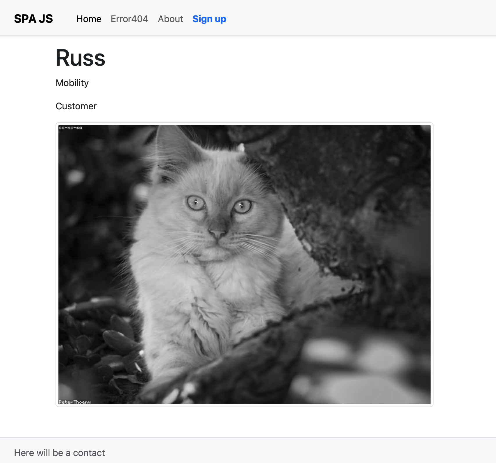

### Single Page Application on JS ES6 with router and MVC

[](https://spa-mvc-router.meugenom.com)
</br>


</br>


[DEMO WEB](https://spa-mvc-router.meugenom.com/)

This is a Single Page Application written in JavaScript ES6, using a simple router and the MVC pattern, and styled with Bootstrap CSS.

### Each component has three files

- index.js which acts as the `Controller`
- model.js which contains the `Model`
- view.js which holds the `View`

For example, the component `Home` has these files located in the `/src/components/home/` folder.

### How to run 

1. Clone the repository with the command `git clone https://github.com/meugenom/spa-mvc-router.git`
2. Change to the directory with `cd spa-mvc-router`.
3. Build the pages with `yarn`.
4. To use the application in dev mode, run `yarn start` in the terminal.

### How to build

```bash
    yarn build && cd dist
```

### Testing

> Unit testing is powered by Jasmine and jsdom for Node.js DOM environment simulation.

***What is covered:***

- Router & URL Parsing: Dynamic route mapping (/, /user/:id), fallback to 404 page, and URL parsing utilities.
- Service Layer: API data fetching (getUsers, getUser) and HTTP error handling.
- Views & Security: Safe HTML rendering and XSS protection escaping.
- Models: Route parameter extraction and data binding.

### Run Unit Tests

```bash
    yarn test
```

### Run Docker

```bash
   docker compose up -d --build  
```

port : 9081

open in browser : `http://localhost:9081`

### License

This project is open-source and available under the [MIT License](LICENSE).

AUTOR: [https://meugenom.com](https://meugenom.com).


